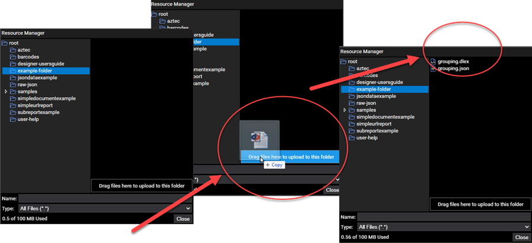

# designer-usersguide-examples
This project contains Designer examples from the Users Guide Layout Elements. 

## Designer Use

To use any of the projects from this project, upload them using the Resource Manager to your cloud storage space. Be certain to upload the DLEX, the JSON, and any related resources to your cloud storage space. 

:::info

All project files in this project run in Designer. Upload the resources needed form your local file system to your DynamicPDF cloud storage.

:::

## Layout Elements

| Layout Element          | File Names                                                   | Description                                                  |
| ----------------------- | ------------------------------------------------------------ | ------------------------------------------------------------ |
| **AztecBarcode**        | `aztec.json`, `aztec.dlex`                                   | Illustrates using an **AztecBarcode** layout element.        |
| **ContentGroup**        | `grouping.dlex`, `grouping.json`                             | Illustrates using a **ContentGroup** layout element.         |
| **DataMatrixBarcode**   | `datamatrix.json`, `datamatrix.dlex`                         | Illustrates using a **DataMatrixBarcode** layout element.    |
| **Document**            | `simpledocument.dlex`, `simpledocument.json`, `Getaway-voaA.otf` | Illustrates using a custom font and several metadata properties of a **Document** layout element. |
| **FormattedRecordArea** | `layoutelements.dlex`, `layoutelements.json`                 | Illustrates using a **FormattedRecordArea** layout element.  |
| **Image**               | `image_example.dlex`, `image_example.json`                   | Illustrates using an **Image** layout element in a report and on a page. |
| **Label**               | `layoutelements.dlex`, `layoutelements.json`                 | Illustrates using a **Label** on a page.                     |
| **Line**                | `layoutelements.dlex`, `layoutelements.json`                 | Illustrates using a **Line** on a page.                      |
| **LinearBarcode**       | `linearbarcode-example.dlex`, `linearbarcode-example.json`   | Illustrates using a **LinearBarcode** layout element with a UPC. |
| **Link**                | `simpleurl.dlex`, `simpleurl.json`                           | Illustrates using a **Link** layout element in a report to create clickable URLs in a PDF. |
| **NoSplitZone**         | `softbreaksubreport.dlex`, `softbreaksubreport.json`         | Illustrates using a **NoSplitZone** layout element to format a report. |
| **PageBreak**           | `pagebreak.dlex`, `pagebreak.json`                           | Illustrates adding a **PageBreak** layout element to a DLEX. |
| **PageNumberingLabel**  | `softbreaksubreport.dlex`, `softbreaksubreport.json`         | Illustrates using a **PageNumberingLabel** layout element on a report's footer. |
| **RecordArea**          | `layoutelements.dlex`, `layoutelements.json`                 | Illustrates using a **RecordArea** layout element.           |
| **RecordBox**           | `layoutelements.dlex`, `layoutelements.json`                 | Illustrates using **RecordBox** layout element on a page and in a report. |
| **Rectangle**           | `layoutelements.dlex`, `layoutelements.json`                 | Illustrates using **Rectangle** layout element by putting rectangles around other layout elements. |
| **SoftBreak**           | `softbreaksubreport.dlex`, `softbreaksubreport.json`         | Illustrates using a **SoftBreak** in a report containing a sub report. The soft break is between the top-level report's name and description. |
| **SubReport**           | `softbreaksubreport.dlex`, `softbreaksubreport.json`         | Illustrates using a **SubReport** in a report containing sub reports. |
| **Symbol**              | `layoutelements.dlex`, `layoutelements.json`                 | Illustrates using **Symbol** on a page and in a report's details. |

# Support

The primary source for the DynamicPDF Cloud API support is through [Stack Overflow](https://stackoverflow.com/questions/tagged/dynamicpdf-api). Please use the "[dynamicpdf-api](https://stackoverflow.com/questions/tagged/dynamicpdf-api)" tag to ask questions. Our support team actively monitors the tag and responds promptly to any questions.  Also, let us know you asked the question by following up with an email to [support@dynamicpdf.com](mailto:support@dynamicpdf.com). 

## Pro Plan Subscribers[#](https://cloud.dynamicpdf.com/support#pro-plan-subscribers)

Ticket support is available to Pro Plan subscribers. But we still encourage you to help the community by posting on Stack Overflow when possible. You can also email [support@dynamicpdf.com](mailto:support@dynamicpdf.com) if you need to ask something specific to your use case that may not help the DynamicPDF Cloud API community.

# License

The `java-client-examples` library is licensed under the [MIT License](./LICENSE).
